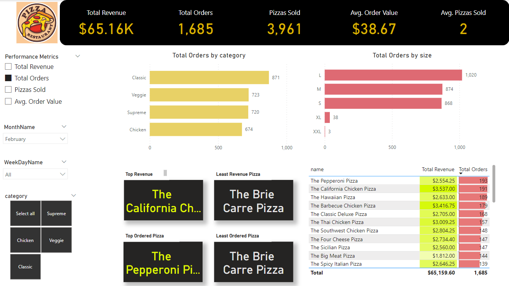

## Pizza Sales analysis

### Introduction:

I conducted an Exploratory Data Analysis on a Pizza Sales restaurant. This project involved examining and analyzing the dataset using SQL to extract valuable insights and trends related to Total revenue, Total Orders, Average revenue per order, order time, monthly and daily sales analysis and more. The EDA aimed to uncover patterns and correlations within the data, providing a foundation for data-driven decision-making. It will help the store owner understand the sales, profits, stock requirement for products and much more to take better decisions and be well prepared with the business.

Dataset Link: https://github.com/Swapppyy/Data-Analysis-of-Pizza-Sales

View my Work over here: <a href="https://github.com/Swapppyy/Data-Analysis-of-Pizza-Sales/blob/main/Queries.sql" target="_blank"><code>My Queries</code></a>

### My Insights:

-      

Checkout my Live Dashboard published over here: <a href="https://www.novypro.com/profile_projects/swapnildeore" target="_blank"><code>Pizza Sales Dashboard</code></a>

### Glimpse of my Dashboard:

  

Checkout my Live Dashboard published over here: <a href="https://www.novypro.com/profile_projects/swapnildeore" target="_blank"><code>Pizza Sales Dashboard</code></a>

    
